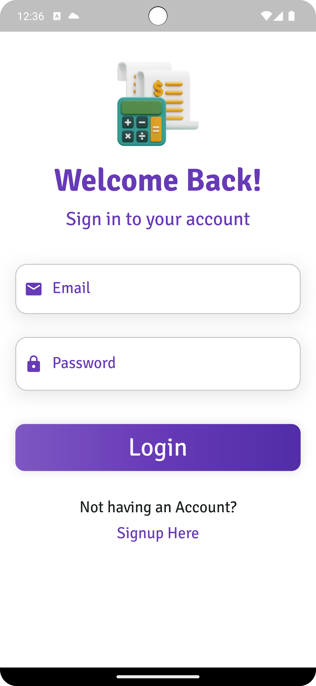
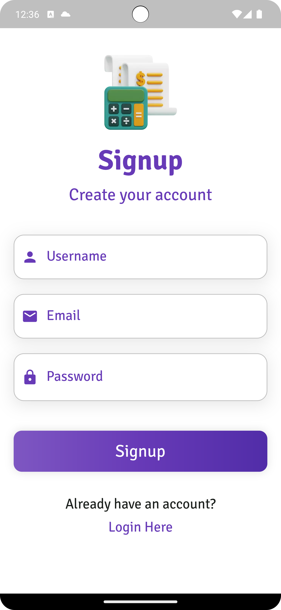
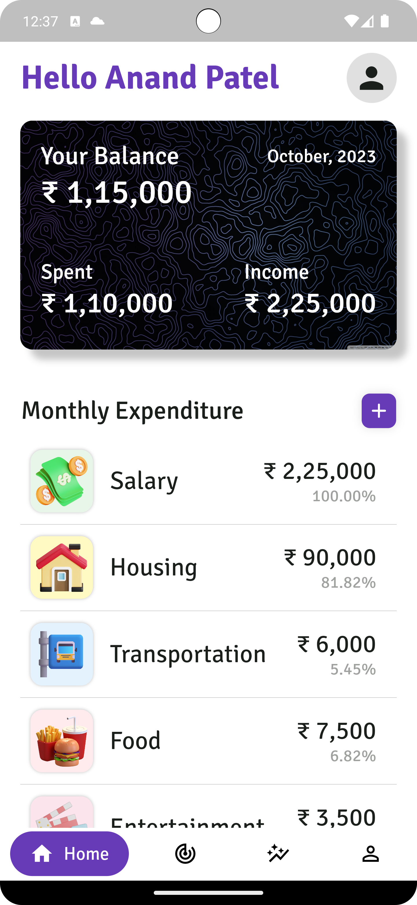
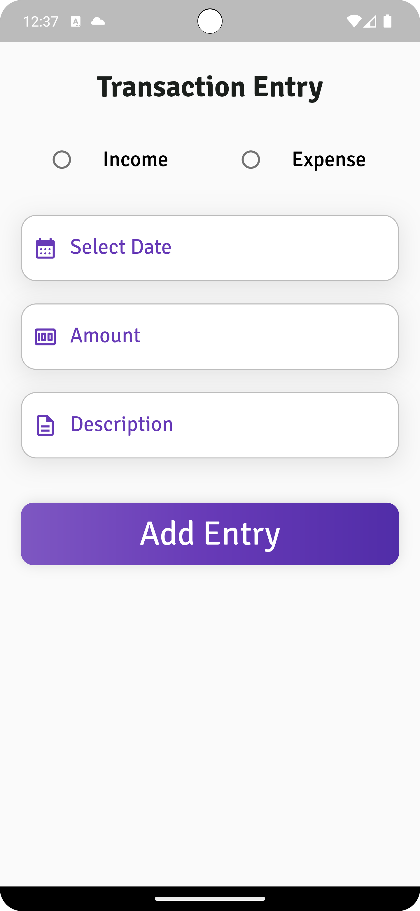
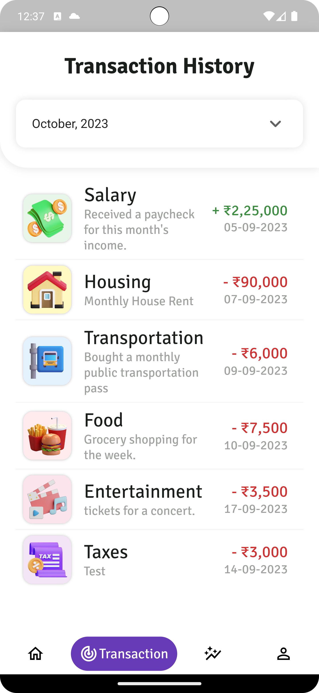
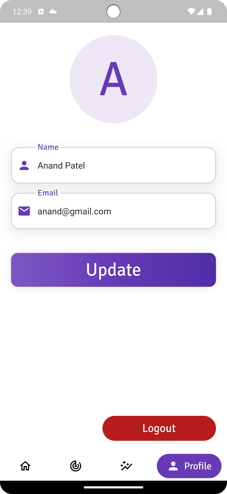
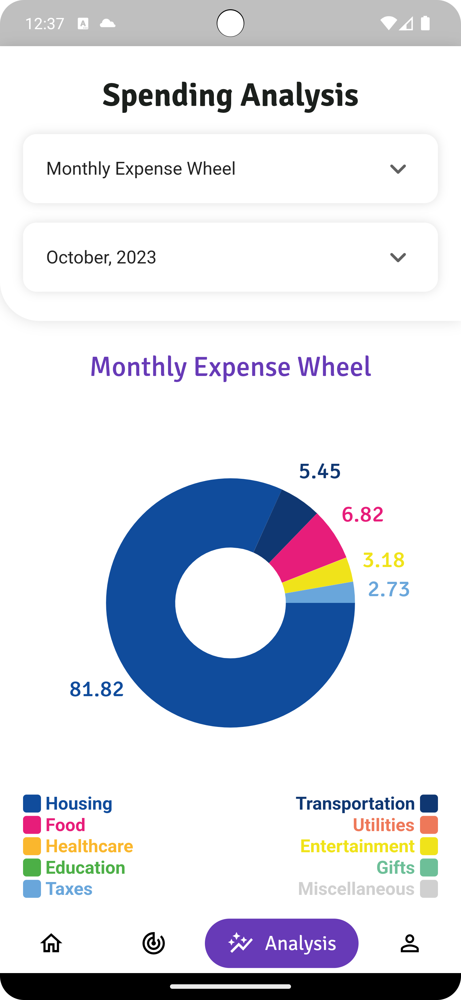
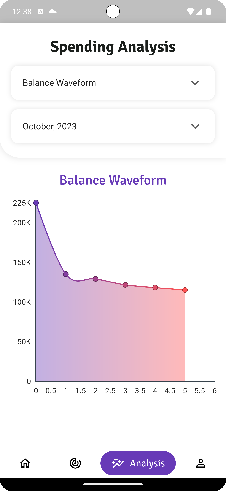
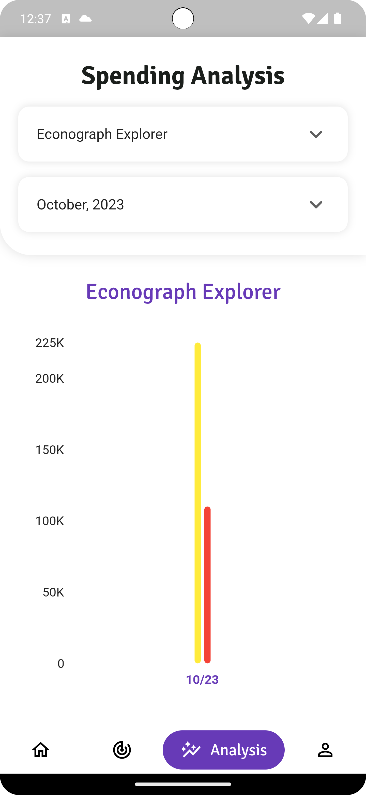

# Budget Buddy Frontend

## Overview

<b>A Flutter application for efficient monthly expense tracking with MongoDB and Node.js. It enables users to seamlessly manage their finances, including viewing past transactions, analyzing monthly expenses through graphs, and tracking income and expenses over time. Empowering individuals to take control of their financial journey.</b>

## Technologies Used

- <b>Flutter:</b> The Budget Buddy frontend is built using the Flutter framework, which allows for cross-platform mobile app development.
- <b>Dart:</b> Dart is the primary programming language used in Flutter development.
- <b>Firebase Storage:</b> User's Profile Image Will be stored in Firebase Storage.

## Installation

### Prerequisites

<b>Flutter:</b> Ensure you have Flutter installed on your development machine. You can find installation instructions at [flutter.dev](https://docs.flutter.dev/get-started/install).

### Getting Started

#### 1. Clone the Gossip Grove Flutter frontend repository to your local machine.

```
git clone https://github.com/Anand-s-FlutterLab/BudgetBuddyFrontend.git
cd budget-buddy-frontend
```

#### 2. Install the project dependencies using Flutter's package manager, pub.

```
flutter pub get
```

#### 3. Set up the backend endpoint in the Flutter code. Open the <u><i>lib/constant/constant.dart</i></u> and specify the URL of your Budget Buddy backend API in <u><i>baseUrl</i></u> variable.

```
const baseUrl = 'https://your-budget-buddy-backend.com';
```

#### 4. Build and run the Flutter app on your preferred platform (iOS or Android).

```
flutter run
```

## Features

The Budget Buddy Flutter frontend offers a range of features, including:

- <b>User Registration and Authentication:</b> Users can create accounts and log in securely to access their financial data.

- <b>Expense Tracking:</b> Users can record and categorize their daily expenses and income, including details like date, category, description, and amount.

- <b>Monthly Expense Overview:</b> The app provides users with a summary of their monthly expenses, including total income, total expenses, and the balance for each month.

- <b>Expense Categories:</b> Users can categorize their expenses, making it easier to understand where their money is going. Common expense categories might include food, transportation, rent, utilities, entertainment, and more.

- <b>Transaction History:</b> Users can view a detailed transaction history to see all their past expenses and income. This helps in tracking and analyzing spending patterns.

- <b>Graphical Analytics:</b> The app generates graphs and charts to visually represent spending patterns and trends over time. Users can analyze their expenses through various types of graphs like pie charts, bar graphs, or line charts.

- <b>Income Tracking:</b> In addition to expenses, users can track their sources of income and monitor how their income varies over time.

- <b>Data Synchronization:</b> The data is stored in a MongoDB database and synchronized across devices, ensuring users can access their financial information from anywhere.

## Screenshots

<p align="center">



</p>
<br>
<p align="center">



</p>
<br>
<p align="center">



</p>
